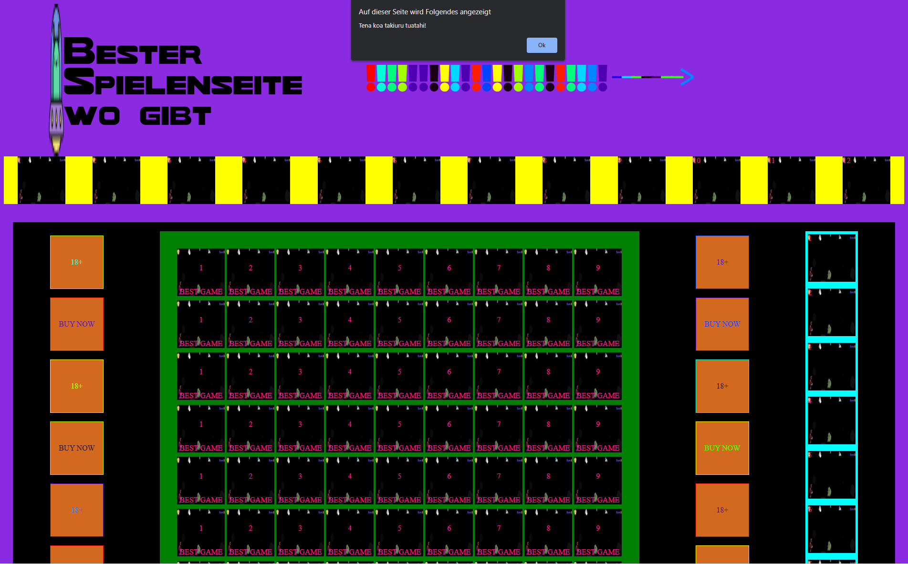
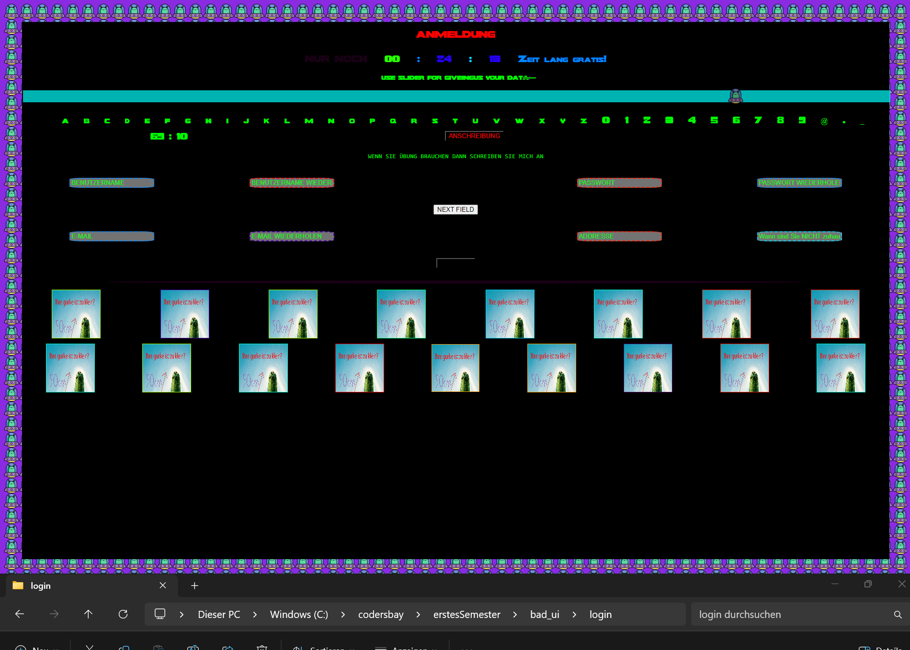
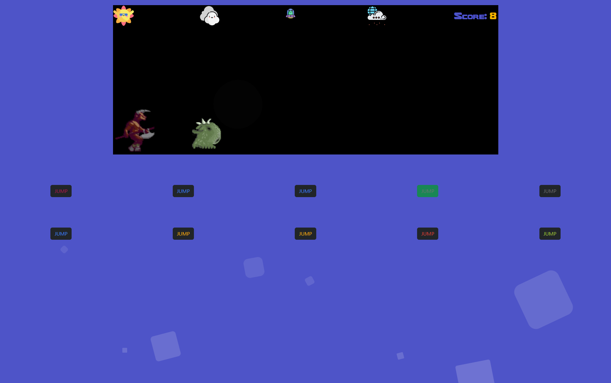

<link rel="stylesheet" href="./projects.css">

  

    

    <!-- Slideshow container -->
      

        <!-- Full-width images with number and caption text -->
        

          
1 / 3

          
          
Main Page - 2000th Browser Games Site

        

        

          
2 / 3

          
          
Tricky, unusual and unexplained login page

        

        

          
3 / 3

          
          
Dino game with unusual controls - animated and with gamesounds

        

        <!-- Next and previous buttons -->
      <a class="prev" onclick="plusSlides(-1)">&#10094;</a>
      <a class="next" onclick="plusSlides(1)">&#10095;</a>
      

       
      <!-- The dots/circles -->
      

        
        
        
      

    

    

        <h3 id="desc-sub" class="subtitle">Description</h3>
    

      As one of our initial tasks at CODERS.BAY Vienna, we were tasked with creating a website in 2 weeks using HTML5, CSS3, and JavaScript, designed to make user interaction as challenging as possible. This project allowed us to freely explore working with vanilla JavaScript and express our creativity in a unique way.
    

    

  

  

    

        <h3 id="inst-sub" class="subtitle">Installation</h3>
    

    

        <ol class="description">
            <li>Download or clone <a href="https://gitlab.com/andiblup/bad_ui">this repository</a></li>
            <ul>
                <li>If downloaded unzip the package</li>
            </ul>
            <li>Open the main folder and drag or open the main.html file with your browser</li>
            <li>Try to make it to the end where the credits are shown</li>
            <ul>
            <li><b>Tip:</b> The second page, the form, is very hard to beat. If you want to skip it you could continue with the login.html file in the login folder</li>
            </ul>
        </ol>
    

  

<!-- 

  

    

        <h3 id="tech-sub" class="subtitle">Used Technologies</h3>
    

    

        
        
        
    

    

        <h3 class="subtitle">Download</h3>
    

    

        
        
    

  

 -->

  

    

        <h3 id="tech-sub" class="subtitle">Used Technologies</h3>
    

    

        
        
        
        
        
        
    

    
  

  

    

            <h3 id="down-sub-3" class="subtitle">Download</h3>
      

      

          
          
        
      

  

