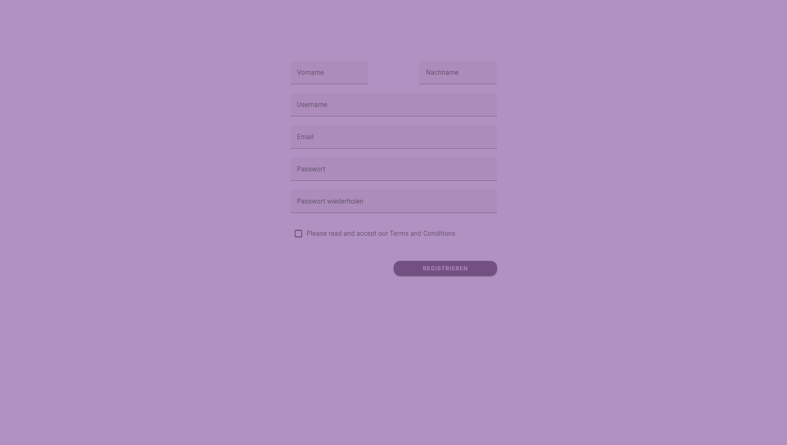
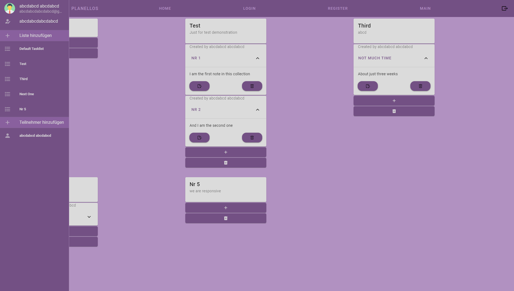
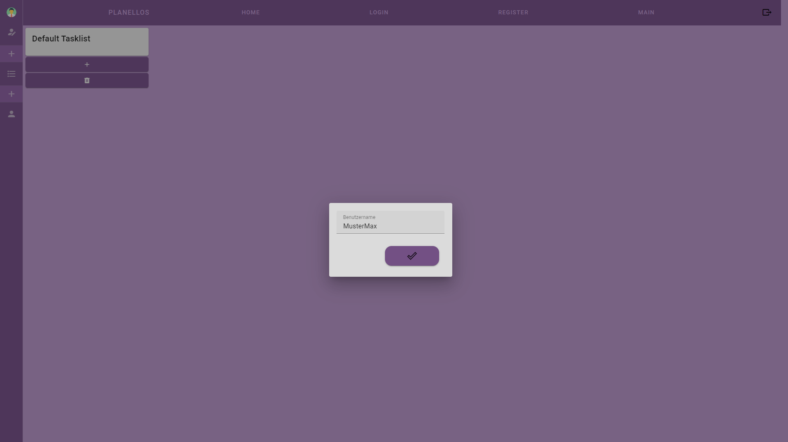
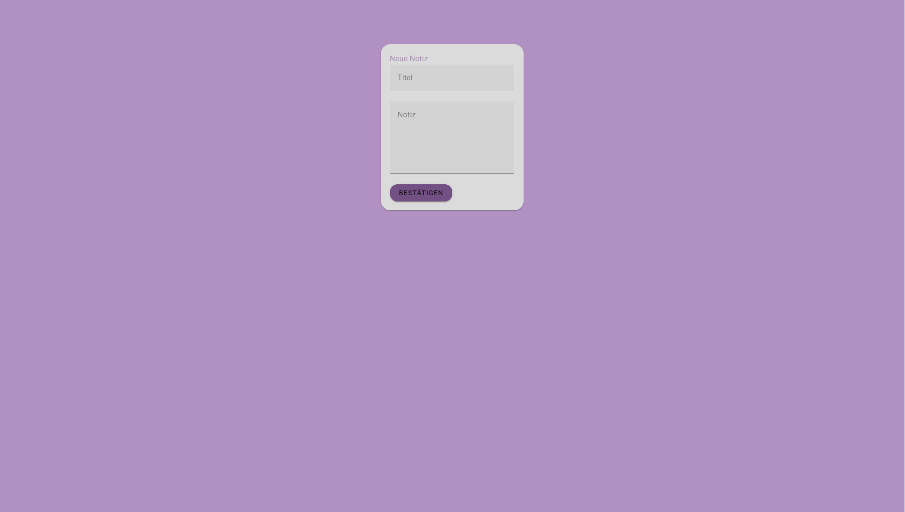
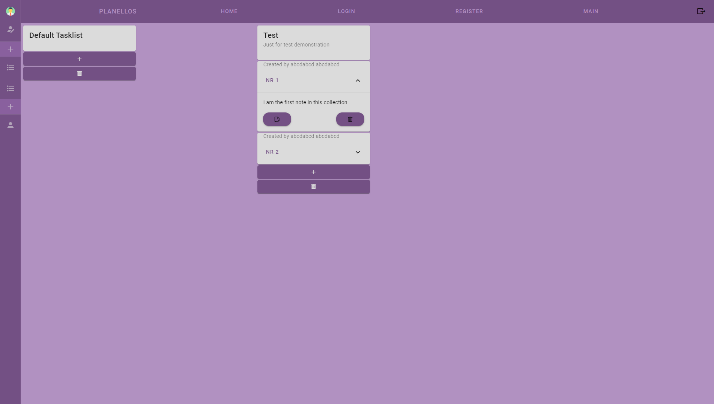
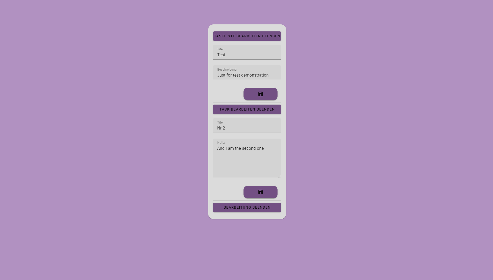

<link rel="stylesheet" href="./projects.css">

<div id="copy-popup" class="hov-desc2 d-none" ></div>
<div style="color: red; font-size: 10rem;">Work<br>in<br>progress</div>
<div style="color: green; font-size: 5rem;">Github/Gitlab and Techstack is correct</div>
<div class="card d-flex">
  <div class="f-row">
    <div class="f-column f-column-left">
    <!-- Slideshow container -->
      <div class="slideshow-container">
        <!-- Full-width images with number and caption text -->
        <div class="mySlides fade">
          <div class="numbertext">1 / 9</div>
          
          <div class="caption">The landing page where the user can either login or register</div>
        </div>
        <div class="mySlides fade">
          <div class="numbertext">2 / 9</div>
          
          <div class="caption">This is the register form</div>
        </div>
        <div class="mySlides fade">
          <div class="numbertext">3 / 9</div>
          
          <div class="caption">In this form the user can login to his/her account</div>
        </div>
        <div class="mySlides fade">
          <div class="numbertext">4 / 9</div>
          
          <div class="caption">This is the homepage the gets directed to</div>
        </div>
        <div class="mySlides fade">
          <div class="numbertext">5 / 9</div>
          
          <div class="caption">
            If you hover on the left side a sidebar will appear<br>
            on the side bar you can edit your profile, get a quick overview<br>and add tasklists or users.
          </div>
        </div>
        <div class="mySlides fade">
          <div class="numbertext">6 / 9</div>
          
          <div class="caption">If you want to add a user to your tasklists you just have to click in the sidebar<br>onto the "Teilnehmer hinzufügen" or the plus icon on top of the userlist.<br>Then just type in the username.</div>
        </div>
        <div class="mySlides fade">
          <div class="numbertext">7 / 9</div>
          
          <div class="caption">
            Onklick at the plus icon at the bottom of each tasklist you can add a new task to it.
          </div>
        </div>
        <div class="mySlides fade">
          <div class="numbertext">8 / 9</div>
          
          <div class="caption">
          After adding a new note you will only see the description.<br>
          You can expand the note, see the content and be able to delete and maintain the single note.
          </div>
        </div>
        <div class="mySlides fade">
          <div class="numbertext">9 / 9</div>
          
          <div class="caption">If you decide to update your note you can update every note by itself and/or the tasklists title and description</div>
        </div>
        <!-- Next and previous buttons -->
      <a class="prev" onclick="plusSlides(-1)">&#10094;</a>
      <a class="next" onclick="plusSlides(1)">&#10095;</a>
      </div>
      <br>
      <!-- The dots/circles -->
      <div style="text-align:center">
        <span class="dot" onclick="currentSlide(1)"></span>
        <span class="dot" onclick="currentSlide(2)"></span>
        <span class="dot" onclick="currentSlide(3)"></span>
      </div>
    </div>
    <div class="f-column f-column-right">
        <h3 id="desc-sub" class="subtitle">Description</h3>
    <p class="description">
      In a four-week project for Web Frontend, I made a Trello copy using VUE.js 3 and used an existing backend. Focusing on user interface design, I translated intricate designs into interactive experiences, ensuring a responsive and dynamic interface. Navigating challenges, the project improved my skills in VUE.js 3, complex user interactions, and responsive design principles. This task deepened my understanding of the technology and showcased my commitment to blending design aesthetics with functional implementation for a memorable user experience.
    </p>
    </div>
  </div>
</div>

<hr style="margin-top: 0.5rem; margin-bottom: 0.5rem;" />

<div class="card d-flex">
  <div class=f-col>
    <div class="f-row">
        <h3 id="inst-sub" class="subtitle">Installation</h3>
    </div>
    <div class="f-row">
        <ol class="description">
            <li>Download or clone <a href="https://github.com/andiblup/ping_pong_gone_wrong">this repository</a></li>
            <ul>
                <li>If downloaded unzip the package</li>
            </ul>
            <li> <b>IMPORTANT!!</b><br>Make sure you have downloaded and installed at least Node version 16.15.
            <br> If needed you can download node <a href="https://nodejs.org/en/download/current">here</a>
            </li>
            <li>Within the terminal navigate to the source folder called "VuetifyProject"<br>
            <ul><li><b>Note </b> that you may now have to run
            </li></ul>
            ```shell
            npm install
            ```
            or
            ```shell
            npm i
            ```
            </li>
            <li>In the source folder now run:
              ```shell
              npm run dev
              ```
              to start hosting the frontend, the standard address is:
              <!-- <blockquote style="border-left-color: #7E56C2; color: teal;" id="inst-sub-sub" class="subtitle">127.0.0.1:3000</blockquote> -->

              ```php
              127.0.0.1:3000
              ```
            </li>
        </ol>
    </div>
  </div>
</div>

<hr style="margin-top: 0.5rem; margin-bottom: 0.5rem;" />


<div class="card d-flex">
  <div class=f-col>
    <div class="f-row">
        <h3 id="tech-sub" class="subtitle">Used Technologies</h3>
    </div>
    <div class="f-row-around">
        <span alt="Java" class="hov-desc"></span>
        <span alt="JMonkey Engine" class="hov-desc"></span>
        <span alt="Intellij" class="hov-desc"></span>
    </div>
    
  </div>
</div>

<hr style="margin-top: 0.5rem; margin-bottom: 0.5rem;" />

<div class="card d-flex">
  <div class=f-col>
<div id="down-sub-2" class="f-row">
        <h3 id="down-sub-3" class="subtitle">Download</h3>
    </div>
    <div class="f-row-around">
          <a alt="Gitlab" class="hov-desc" href="https://gitlab.com/Hinotori91/coderscape">
            
          </a>
    </div>
</div>
</div>

