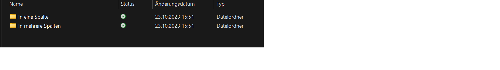
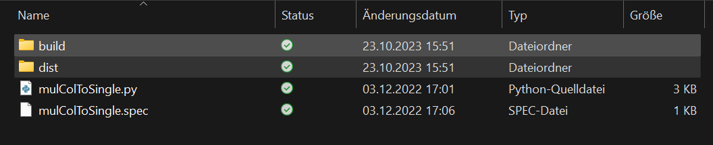
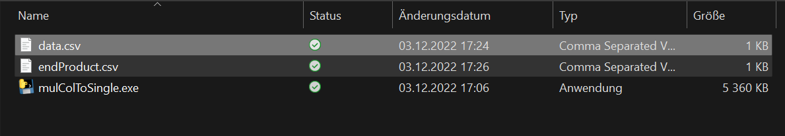
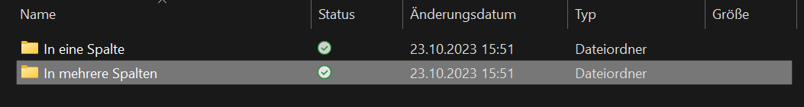
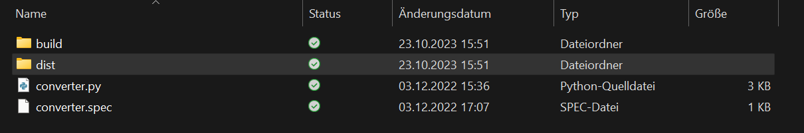
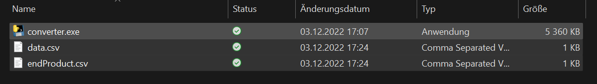

<link rel="stylesheet" href="./projects.css">

<div class="card d-flex">
  <div class="f-row">
    <div class="f-column f-column-left">
    <!-- Slideshow container -->
      <div class="slideshow-container">
        <!-- Full-width images with number and caption text -->
        <div class="mySlides fade">
          <div class="numbertext">1 / 6</div>
          
          <div class="caption">Here you have to choose which kind of manipulation you want to do <br> "In eine Spalte" means into one column</div>
        </div>
        <div class="mySlides fade">
          <div class="numbertext">2 / 6</div>
          
          <div class="caption">In the dist folder is the data stored, the converter.py file is stored here (relevant if not using the exe)</div>
        </div>
        <div class="mySlides fade">
          <div class="numbertext">3 / 6</div>
          
          <div class="caption">Both marked are the input and the output data, the folder also contains the .exe file</div>
        </div>
        <div class="mySlides fade">
          <div class="numbertext">4 / 6</div>
          
          <div class="caption">Here you have to choose which kind of manipulation you want to do <br> "In mehrere Spalten" means into many columns</div>
        </div>
        <div class="mySlides fade">
          <div class="numbertext">5 / 6</div>
          
          <div class="caption">In the dist folder is the data stored, the converter.py file is stored here (relevant if not using the exe)</div>
        </div>
        <div class="mySlides fade">
          <div class="numbertext">6 / 6</div>
          
          <div class="caption">Both marked are the input and the output data, the folder also contains the .exe file</div>
        </div>
        <!-- Next and previous buttons -->
      <a class="prev" onclick="plusSlides(-1)">&#10094;</a>
      <a class="next" onclick="plusSlides(1)">&#10095;</a>
      </div>
      <br>
      <!-- The dots/circles -->
      <div style="text-align:center">
        <span class="dot" onclick="currentSlide(1)"></span>
        <span class="dot" onclick="currentSlide(2)"></span>
        <span class="dot" onclick="currentSlide(3)"></span>
        <span class="dot" onclick="currentSlide(4)"></span>
        <span class="dot" onclick="currentSlide(5)"></span>
        <span class="dot" onclick="currentSlide(6)"></span>
      </div>
    </div>
    <div class="f-column f-column-right">
        <h3 id="desc-sub" class="subtitle">Description</h3>
    <p class="description">
      A script I wrote for a friend for CSV manipulation. It splits the data received from the server, initially separated by commas within a single column, into separate columns for easier editing in Excel. Additionally, there is a script to reformat these divided data back into a single column.
    </p>
    </div>
  </div>
</div>

<hr style="margin-top: 0.5rem; margin-bottom: 0.5rem;" />

<div class="card d-flex">
  <div class=f-col>
    <div class="f-row">
        <h3 id="inst-sub" class="subtitle">Installation</h3>
    </div>
    <div class="f-row">
        <blockquote style="border-left-color: #7E56C2; color: teal;" id="inst-sub-sub" class="subtitle">Into many Columns</blockquote>
    </div>
    <div class="f-row">
        <ol class="description">
            <li>Download or clone <a href="https://github.com/andiblup/csv_manip">this repository</a></li>
            <ul>
                <li>If downloaded unzip the package</li>
            </ul>
            <li>Open the "In mehrere Spalten" folder, here is where you will drop your .csv file</li>
            <li>IMPORTANT: The default file name has to be data.csv and the product will be called endProduct.csv</li>
            <ul>
              <li>
                You could change theese names in the lines 8 and p of the converter.py file, but it wont change anything in the .exe programm. You would have to run everything with the python command in the terminal instead of      doubleklick the .exe programm.
              </li>
              <li>
                If you use the .exe and the default names
              </li>
              <ol>
                <li>Copie the file you want to transform into the "dist" folder</li>
                <li>Doubleclick the converter.exe</li>
              </ol>
              <li>
                If you dont use the exe
              </li>
              <ol>
                <li>Make sure you have installed at least Python 3.8 and added it to the path variables</li>
                <li>Copie the file you want to transform into the SAME folder with the converter.py</li>
                <li>Open this folder with the terminal</li>
                <li>Then use the command: 
                ```shell
                python converter.py
                ```
                or
                ```shell
                python3 converter.py
                ```
                to run the script
                </li>
              </ol>
            </ul>
        </ol>
    </div>
    <div class="f-row">
        <blockquote style="border-left-color: #7E56C2; color: teal;" id="inst-sub-sub" class="subtitle">Into a single Column</blockquote>
    </div>
    <div class="f-row">
        <ol class="description">
            <li>Download or clone <a href="https://github.com/andiblup/csv_manip">this repository</a></li>
            <ul>
                <li>If downloaded unzip the package</li>
            </ul>
            <li>Open the "In eine Spalte" folder, here is where you will drop your .csv file</li>
            <li>IMPORTANT: The default file name has to be data.csv and the product will be called endProduct.csv</li>
            <ul>
              <li>
                You could change theese names in the lines 8 and p of the converter.py file, but it wont change anything in the .exe programm. You would have to run everything with the python command in the terminal instead of doubleklick the .exe programm. Alternate you can convert it manually into a .wxe by yourself, you can find help <a href="https://pyinstaller.org/en/stable/">here</a>.
              </li>
              <li>
                If you use the .exe and the default names
              </li>
              <ol>
                <li>Copie the file you want to transform into the "dist" folder</li>
                <li>Doubleclick the converter.exe</li>
              </ol>
              <li>
                If you dont use the exe
              </li>
              <ol>
                <li>Make sure you have installed at least Python 3.8 and added it to the path variables</li>
                <li>Copie the file you want to transform into the SAME folder with the converter.py</li>
                <li>Open this folder with the terminal</li>
                <li>Then use the command: 
                ```shell
                python converter.py
                ```
                or
                ```shell
                python3 converter.py
                ```
                to run the script
                </li>
              </ol>
            </ul>
        </ol>
    </div>
  </div>
</div>

<hr style="margin-top: 0.5rem; margin-bottom: 0.5rem;" />

<!-- <div class="card d-flex">
  <div class=f-col>
    <div class="f-row">
        <h3 id="tech-sub" class="subtitle">Used Technologies</h3>
    </div>
    <div class="f-row-around">
        
        
        
    </div>
    <div id="down-sub" class="f-row">
        <h3 class="subtitle">Download</h3>
    </div>
    <div class="f-row-around">
        <a href="https://gitlab.com/andiblup/bad_ui"></a>
        <a href="https://gitlab.com/andiblup/bad_ui"></a>
    </div>
  </div>
</div>

<hr style="margin-top: 0.5rem; margin-bottom: 0.5rem;" /> -->

<div class="card d-flex">
  <div class=f-col>
    <div class="f-row">
        <h3 id="tech-sub" class="subtitle">Used Technologies</h3>
    </div>
    <div class="f-row-around">
        
    </div>
    
  </div>
</div>

<hr style="margin-top: 0.5rem; margin-bottom: 0.5rem;" />

<div class="card d-flex">
  <div class=f-col>
<div id="down-sub-2" class="f-row">
        <h3 id="down-sub-3" class="subtitle">Download</h3>
    </div>
    <div class="f-row-around">
        <a href="https://github.com/andiblup/csv_manip"></a>
    </div>
</div>
</div>

<!-- <script>
  let slideIndex = 1;
  //let slides = document.getElementsByClassName("mySlides");
showSlides(slideIndex);

// Next/previous controls
function plusSlides(n) {
  showSlides(slideIndex += n);
}

// Thumbnail image controls
function currentSlide(n) {
  showSlides(slideIndex = n);
}

function showSlides(n) {
  let i;
  let slides = document.getElementsByClassName("mySlides");
  let dots = document.getElementsByClassName("dot");
  if (n > slides.length) {slideIndex = 1}
  if (n < 1) {slideIndex = slides.length}
  for (i = 0; i < slides.length; i++) {
    slides[i].style.display = "none";
  }
  for (i = 0; i < dots.length; i++) {
    dots[i].className = dots[i].className.replace(" active", "");
  }
  slides[slideIndex-1].style.display = "block";
  dots[slideIndex-1].className += " active";
}

let imgIsBig = false;
let next = document.getElementsByClassName("next");
let prev = document.getElementsByClassName("prev");
let caption = document.getElementsByClassName("caption");
let numbertext = document.getElementsByClassName("numbertext");

function enlargeImg(id) {
    if (imgIsBig) {
        resetImg(id);
        imgIsBig = false;
        //console.log(numbertext);
        for (let element of numbertext) {
          element.style.display = "block"
        }
        for (let element of caption) {
          element.style.display = "block"
        }
        for (let element of prev) {
          element.style.display = "block"
        }
        for (let element of next) {
          element.style.display = "block"
        }
        
        // numbertext.style.display = "block";
        // next.style.display = "block";
        // prev.style.display = "block";
        // caption.style.display = "block";
    } else {
        img = document.getElementById(id);
        img.style.transform = "scale(2.5)";
        img.style.transition = "transform 0.25s ease";
        //img.style.marginTop = "5rem";
        imgIsBig = true;

        for (let element of numbertext) {
          element.style.display = "none"
        }
        for (let element of caption) {
          element.style.display = "none"
        }
        for (let element of prev) {
          element.style.display = "none"
        }
        for (let element of next) {
          element.style.display = "none"
        }

        // slides[slideIndex-1].style.transform = "scale(3)";
        // slides[slideIndex-1].style.transition = "transform 0.25s ease";
        // slides[slideIndex-1].style.marginTop = "5rem";
        // imgIsBig = true;
        // next.style.display = "none";
        // prev.style.display = "none";
        // caption.style.display = "none";

    }
    
}
function resetImg(id) {
    img = document.getElementById(id);
    img.style.transform = "scale(1)";
    img.style.transition = "transform 0.25s ease";
    //img.style.marginTop = "0rem";
    
    // img = document.getElementById(id);
    // slides[slideIndex-1].style.transform = "scale(1)";
    // slides[slideIndex-1].style.transition = "transform 0.25s ease";
    }
</script> -->
