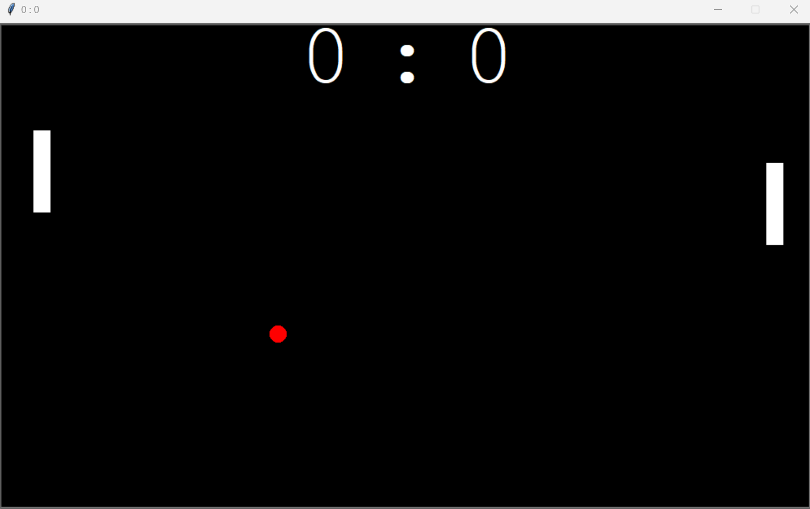
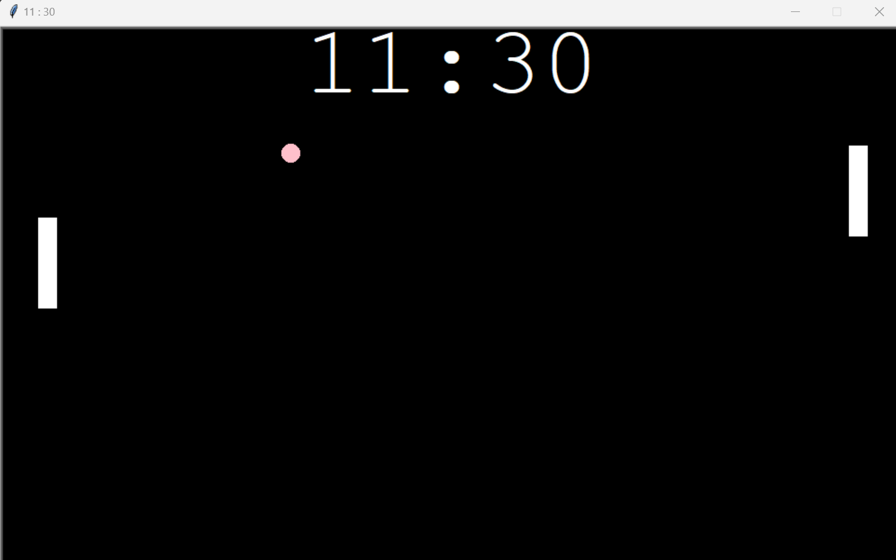
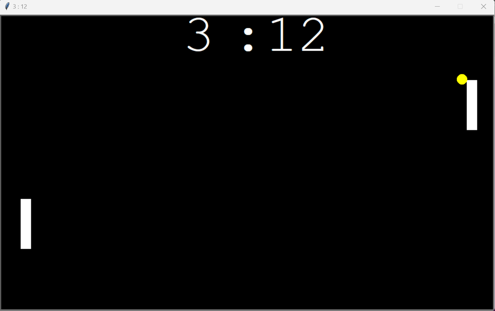

<link rel="stylesheet" href="./projects.css">

<div id="copy-popup" class="hov-desc2 d-none" ></div>
<div class="card d-flex">
  <div class="f-row">
    <div class="f-column f-column-left">
    <!-- Slideshow container -->
      <div class="slideshow-container">
        <!-- Full-width images with number and caption text -->
        <div class="mySlides fade">
          <div class="numbertext">1 / 3</div>
          
          <div class="caption">This is how it looks like if you started the project</div>
        </div>
        <div class="mySlides fade">
          <div class="numbertext">2 / 3</div>
          
          <div class="caption">The game is over when its participants decide to</div>
        </div>
        <div class="mySlides fade">
          <div class="numbertext">3 / 3</div>
          
          <div class="caption">One of the key features:<br>You can catch the ball in your paddle and speed it up with every bounce<br>But as faster as it gets it will be harder to control the direction it will be shot</div>
        </div>
        <!-- Next and previous buttons -->
      <a class="prev" onclick="plusSlides(-1)">&#10094;</a>
      <a class="next" onclick="plusSlides(1)">&#10095;</a>
      </div>
      <br>
      <!-- The dots/circles -->
      <div style="text-align:center">
        <span class="dot" onclick="currentSlide(1)"></span>
        <span class="dot" onclick="currentSlide(2)"></span>
        <span class="dot" onclick="currentSlide(3)"></span>
      </div>
    </div>
    <div class="f-column f-column-right">
        <h3 id="desc-sub" class="subtitle">Description</h3>
    <p class="description">
      In my second programming project, I created a two-player version of Pong, facing and overcoming challenges with adaptability. The project highlighted the importance of technology choices in shaping the interactive experience, blending coding with an exploration of hardware-software dynamics. Turning setbacks into strengths, I transformed bugs into intentional features, showcasing the transformative power of creative problem-solving in game development. This Pong journey illustrates how technical expertise and creativity can elevate a classic game recreation into a distinctive masterpiece.
    </p>
    </div>
  </div>
</div>

<hr style="margin-top: 0.5rem; margin-bottom: 0.5rem;" />

<div class="card d-flex">
  <div class=f-col>
    <div class="f-row">
        <h3 id="inst-sub" class="subtitle">Installation</h3>
    </div>
    <div class="f-row">
        <ol class="description">
            <li>Download or clone <a href="https://github.com/andiblup/ping_pong_gone_wrong">this repository</a></li>
            <ul>
                <li>If downloaded unzip the package</li>
            </ul>
            <li> <b>IMPORTANT!!</b><br>Make sure you have at least Python 3.8 installed and added to the path variables. 
            <br> If needed you can download python <a href="https://www.python.org/downloads/">here</a></li>
            <li>Try to make it to the end where the credits are shown</li>
            <li>Navigate into the rainbow_snake folder and open it with the terminal</li>
            <li>Then use the command: 
                ```shell
                python main.py
                ```
                or
                ```shell
                python3 main.py
                ```
                to run the script
                </li>
        </ol>
    </div>
  </div>
</div>

<hr style="margin-top: 0.5rem; margin-bottom: 0.5rem;" />


<div class="card d-flex">
  <div class=f-col>
    <div class="f-row">
        <h3 id="tech-sub" class="subtitle">Used Technologies</h3>
    </div>
    <div class="f-row-around">
        <span alt="Python" class="hov-desc">
        
        </span>
    </div>
    
  </div>
</div>

<hr style="margin-top: 0.5rem; margin-bottom: 0.5rem;" />

<div class="card d-flex">
  <div class=f-col>
<div id="down-sub-2" class="f-row">
        <h3 id="down-sub-3" class="subtitle">Download</h3>
    </div>
    <div class="f-row-around">
        <a alt="Github" class="hov-desc" href="https://github.com/andiblup/ping_pong_gone_wrong"></a>
    </div>
</div>
</div>

